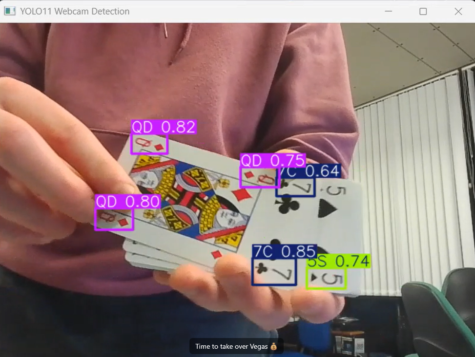

# Card Classifier using YOLOv11

This project implements a real-time playing-card classifier using **YOLOv11**.  
The model detects card ranks and suits from images or video streams, making it suitable for applications such as card-game automation, probability tracking, or computer-vision research.

## Features
- 🚀 **Fast inference** with YOLOv11  
- 🃏 **Rank + suit classification** (e.g., `7H`, `QS`, `AC`)  
- 🎥 Supports **image, video, and webcam** inputs  
- 🧩 Easy to retrain on custom card datasets  
- 🛠 Configurable confidence thresholds and NMS settings

##  Example

